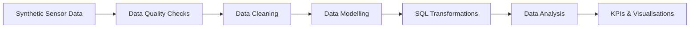
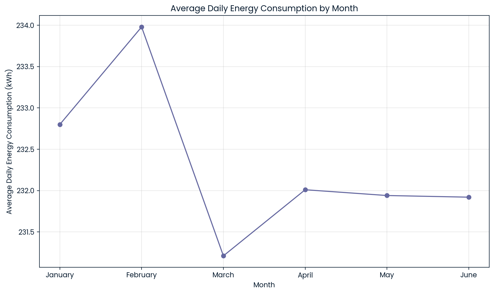
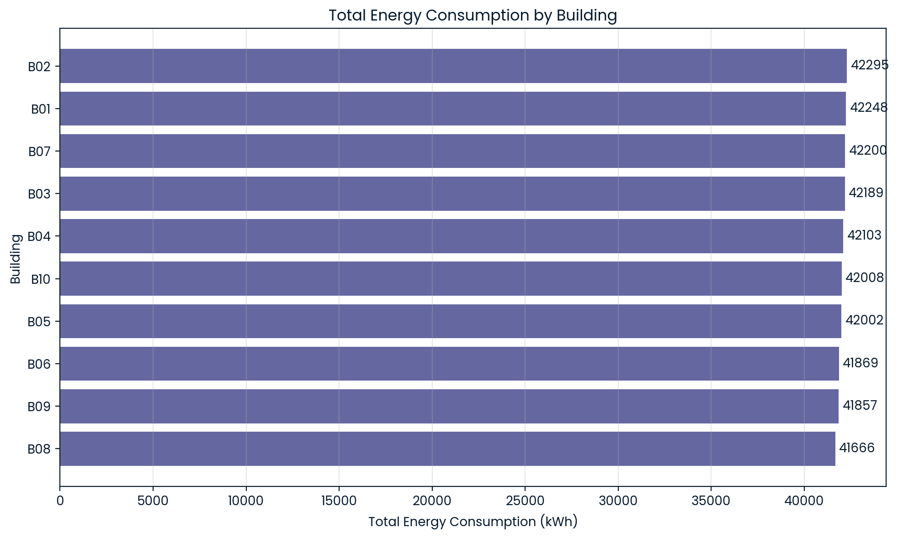
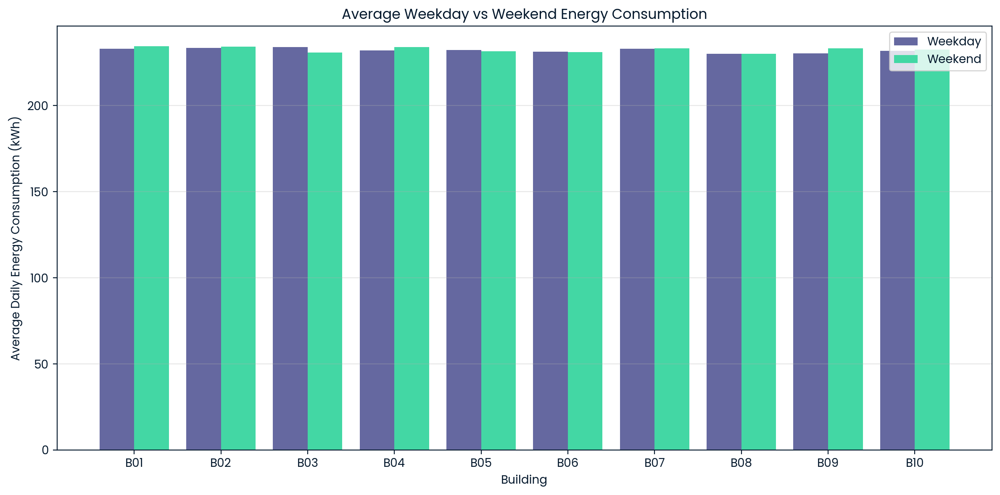

# Smart Energy Data Platform

An end-to-end data engineering project that simulates, validates, cleans, models and transforms smart energy sensor data using **Python and SQL**.

The project demonstrates a complete data workflow from raw sensor-data generation through data quality checks, cleaning, dimensional modelling, SQL transformations, KPI generation and analytical visualisation.

---

## Project Overview

This project simulates six months of hourly energy-monitoring data from **50 sensors across 10 buildings**.

The raw dataset is intentionally populated with common data-quality problems to represent issues that can occur in real-world sensor pipelines. The data is then validated, cleaned and transformed into analytics-ready datasets for building-level and time-based energy analysis.

The project demonstrates:

- Synthetic data generation
- Data quality validation
- Data cleaning
- Dimensional data modelling
- SQL transformations
- Common Table Expressions (CTEs)
- Aggregations
- Window functions
- Month-on-month analysis
- KPI generation
- Energy-consumption analysis
- Data visualisation

---

## Tech Stack

| Technology | Purpose |
|---|---|
| Python | Data generation, cleaning and processing |
| pandas | Data manipulation and transformation |
| NumPy | Synthetic data generation |
| SQL | Data validation, transformation and analysis |
| Matplotlib | Data visualisation |
| DataCamp DataLab | Development and notebook environment |
| GitHub | Version control and project documentation |

---

## Dataset

The base dataset contains hourly readings from **1 January 2026 to 30 June 2026**.

| Metric | Value |
|---|---:|
| Buildings | 10 |
| Sensors | 50 |
| Sensors per building | 5 |
| Hourly timestamps | 4,344 |
| Base sensor readings | 217,200 |

Each sensor reading contains:

- `timestamp`
- `sensor_id`
- `building_id`
- `voltage`
- `current`
- `power_factor`
- `temperature`
- `energy_kwh`

Energy consumption is calculated from voltage, current and power factor for each hourly reading.

---

## Data Quality Simulation

To make the project more representative of a real data-engineering workflow, data-quality problems are deliberately introduced into the raw dataset.

These include:

- Missing `energy_kwh` values
- Duplicate sensor readings
- Negative energy values
- Extreme energy readings
- Out-of-range voltage readings

The resulting raw dataset contains **218,286 records** after duplicate rows are introduced.

SQL-based quality checks are then used to identify issues before the cleaning stage.

### Example Data Quality Checks

```sql
-- Check for duplicate sensor readings
SELECT
    timestamp,
    sensor_id,
    COUNT(*) AS record_count
FROM df
GROUP BY timestamp, sensor_id
HAVING COUNT(*) > 1;
```

Additional checks validate:

- Missing values
- Energy ranges
- Voltage ranges
- Sensor ID formats
- Building ID formats

---

## Data Pipeline



The pipeline follows seven main stages:

1. **Generate** synthetic smart-energy sensor data.
2. **Validate** the raw data using SQL-based quality checks.
3. **Clean** missing, duplicate and invalid records.
4. **Model** the cleaned data into analytics-ready structures.
5. **Transform** the data using SQL.
6. **Analyse** building and time-based energy consumption.
7. **Visualise** the resulting KPIs and trends.

---

## Data Cleaning

The cleaning stage prepares the raw sensor data for downstream analysis.

The process includes:

- Removing duplicate sensor readings
- Handling missing energy values
- Removing invalid negative energy readings
- Removing extreme energy readings
- Removing invalid voltage readings
- Validating sensor and building identifiers
- Ensuring appropriate data types

After cleaning, the pipeline contains **215,045 valid sensor readings**.

---

## Data Modelling

The cleaned data is organised into structured analytical datasets.

The modelling stage separates descriptive attributes from measurable sensor readings and prepares the data for efficient SQL analysis.

This makes it possible to perform analysis across dimensions such as:

- Building
- Sensor
- Date
- Month
- Energy consumption

<!-- OPTIONAL: Add your data-model diagram here when available.


-->

---

## SQL Transformations

SQL is used to transform the cleaned data into datasets suitable for analytical reporting.

Techniques demonstrated include:

- `GROUP BY` aggregations
- Common Table Expressions (`WITH`)
- Date and month transformations
- Window functions
- `LAG()`
- `NULLIF()`
- Month-on-month comparisons
- KPI calculations
- Building-level aggregations
- Time-series aggregations

### Example: Month-on-Month Analysis

```sql
LAG(total_energy_kwh) OVER (
    PARTITION BY building_id
    ORDER BY year, month
) AS previous_month_energy_kwh
```

This allows the pipeline to compare each building's energy consumption with the previous month.

---

## Key Results

Following validation and cleaning, the pipeline produces an analytics-ready dataset with the following headline KPIs:

| KPI | Result |
|---|---:|
| Buildings | 10 |
| Sensors | 50 |
| Valid sensor readings | 215,045 |
| Total energy consumption | 420,437.63 kWh |
| Average sensor power | 1.955 kW |
| Peak sensor power | 4.968 kW |
| Average voltage | 230.01 V |
| Average power factor | 0.85 |
| Average temperature | 10.05 °C |

The processed data can be used to:

- Compare energy consumption between buildings
- Track energy usage over time
- Measure month-on-month changes
- Identify high-consumption buildings
- Monitor electrical and environmental metrics

---

## Results & Visualisations

This section highlights the main analytical outputs from the project.

### 1. Monthly Energy Consumption Trend

Shows how average daily energy consumption changes across the six-month period.




### 2. Energy Consumption by Building

Compares total or average energy consumption across the 10 buildings.




### 3. Weekday vs Weekend Consumption

Shows the difference in average energy consumption on weekdays vs weekends for each building.




---

## Repository Structure

```text
smart-energy-data-platform/
│
├── README.md
├── smart_energy_data_platform.ipynb
├── .gitignore
├── LICENSE
│
└── images/
    ├── monthly_energy_trend.png
    ├── building_energy_comparison.png
    └── weekday_weekend_comparison.png
```

The dataset does not need to be stored separately because it is generated reproducibly within the notebook.

---

## Running the Project

### Option 1 — View on GitHub

Open:

```text
smart_energy_data_platform.ipynb
```

GitHub can render the notebook directly, allowing the code, explanations, tables and visualisations to be viewed without running the project.

### Option 2 — Run Locally

Clone the repository:

```bash
git clone https://github.com/bilbashi/smart-energy-data-platform.git
cd smart-energy-data-platform
```

Install the required Python packages:

```bash
pip install pandas numpy matplotlib
```

Then open:

```text
smart_energy_data_platform.ipynb
```

in Jupyter Notebook, JupyterLab or another compatible notebook environment.

> Some SQL cells were developed in DataCamp DataLab, so running the notebook outside DataLab may require adapting those SQL-specific cells to another SQL environment.

---

## Project Skills Demonstrated

This project demonstrates practical experience with:

**Data Engineering**
- Data pipeline design
- Data validation
- Data cleaning
- Data transformation
- Dimensional modelling
- Analytics-ready dataset creation

**SQL**
- Aggregations
- CTEs
- Window functions
- `LAG()`
- Date transformations
- KPI calculations
- Month-on-month analysis

**Python**
- pandas
- NumPy
- Data generation
- Data manipulation
- Data validation
- Matplotlib visualisation

**Engineering Practices**
- Reproducible data generation
- Structured workflow design
- Data-quality testing
- Technical documentation
- Version control with GitHub

---

## Future Development

A future version of the project will extend the pipeline into **AWS** to demonstrate cloud-based data engineering.

Potential improvements include:

- Cloud-based object storage
- Cloud ETL processing
- SQL-based analytical querying
- Automated pipeline execution
- Pipeline monitoring
- Cloud architecture documentation

This will build on the same data-engineering workflow while moving storage and processing from the notebook environment into a cloud-based architecture.

---

## Notebook

The complete implementation is available here:

[View the project notebook](smart_energy_data_platform.ipynb)

---

## License

This project is licensed under the **MIT License**. See the [LICENSE](LICENSE) file for details.
